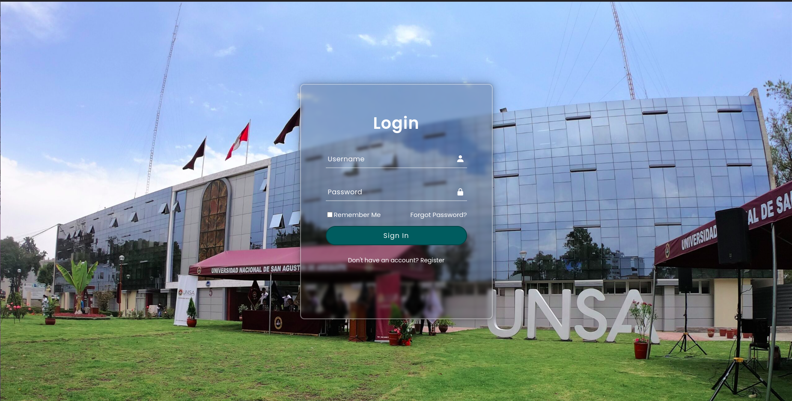
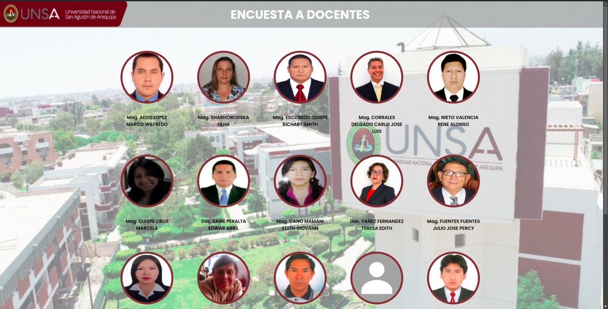
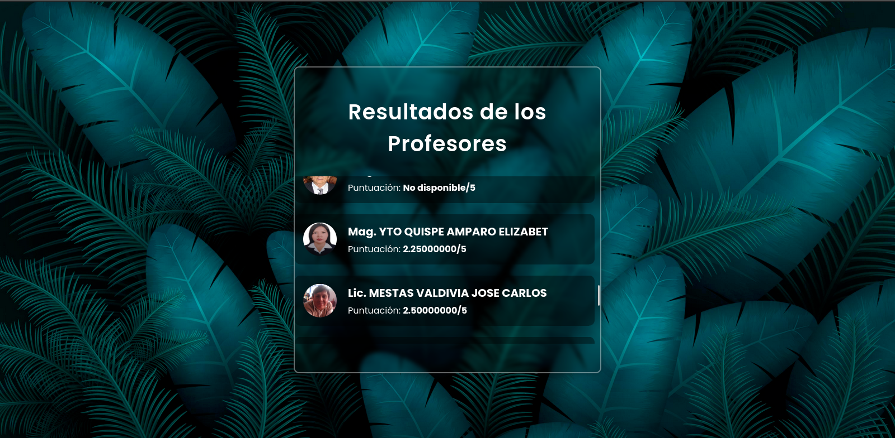

<div align="center">
<table>
    <theader>
        <tr>
            <td></td>
            <th>
                <span style="font-weight:bold;">UNIVERSIDAD NACIONAL DE SAN AGUSTIN</span><br />
                <span style="font-weight:bold;">FACULTAD DE INGENIERÍA DE PRODUCCIÓN Y SERVICIOS</span><br />
                <span style="font-weight:bold;">DEPARTAMENTO ACADÉMICO DE INGENIERÍA DE SISTEMAS E INFORMÁTICA</span><br />
                <span style="font-weight:bold;">ESCUELA PROFESIONAL DE INGENIERÍA DE SISTEMAS</span>
            </th>
            <td></td>
        </tr>
    </theader>
    <tbody>
        <tr><td colspan="3"><span style="font-weight:bold;">Formato</span>: Guía de Práctica de Laboratorio</td></tr>
        <tr><td><span style="font-weight:bold;">Aprobación</span>:  2022/03/01</td><td><span style="font-weight:bold;">Código</span>: GUIA-PRLD-001</td><td><span style="font-weight:bold;">Página</span>: 1</td></tr>
    </tbody>
</table>
</div>

<div align="center">
<span style="font-weight:bold;">PROYECTO FINAL</span><br />
</div>


<table>
<theader>
<tr><th colspan="6">INFORMACIÓN BÁSICA</th></tr>
</theader>
<tbody>
<tr><td>ASIGNATURA:</td><td colspan="5">Programación Web 1</td></tr>
<tr><td>TÍTULO DEL PROYECTO:</td><td colspan="5">ENCUEST DOCENTS
</td></tr>
<tr>
<td>PROYECTO:</td><td>01</td><td>AÑO LECTIVO:</td><td>2024 b</td><td>NRO. SEMESTRE:</td><td>II</td>
</tr>
<tr>
<td>FECHA INICIO:</td><td>12-Nov-2024</td><td>FECHA FIN:</td><td>18-Dic-2024</td><td>DURACIÓN:</td><td>04 horas</td>
</tr>
<tr><td colspan="6">RECURSOS:
    <ul>
      <li><a href="https://git-scm.com/book/es/v2">https://git-scm.com/book/es/v2</a></li>
      <li><a href="https://guides.github.com/">https://guides.github.com/</a></li>        
      <li><a href="https://www.perl.org/get.html">https://www.perl.org/get.html</a></li>
    </ul>
</<tr>
<tr><td colspan="6">DOCENTES:
<ul>
<li>Richart Smith Escobedo Quispe - Carlo Jose Luis Corrales Delgado</li>
 </ul>
      </td>
    </tr>
    <tr>
      <td colspan="6">
        <strong>INTEGRANTES DEL GRUPO:</strong>
        <ul>
          <li>Estefanero Palma Rodrigo - restefanerop@unsa.edu.pe</li>
          <li>Quispe Mamani Jose Gabriel - josquispem@unsa.edu.pe</li>
        </ul>
      </td>
    </tr>
  </tbody>
</table>

# Git - GitHub - Perl - Docker - JS - SQL


[![Git][Git]][git-site]
[![GitHub][GitHub]][github-site]
[![Perl][Perl]][perl-site]
[![Docker][Docker]][docker-site]
[![JavaScript][JavaScript]][javascript-site]
[![MySQL][MySQL]][mysql-site]

[Docker]: https://img.shields.io/badge/docker-%230db7ed.svg?style=for-the-badge&logo=docker&logoColor=white
[docker-site]: https://www.docker.com/

[JavaScript]: https://img.shields.io/badge/javascript-%23323330.svg?style=for-the-badge&logo=javascript&logoColor=%23F7DF1E
[javascript-site]: https://developer.mozilla.org/en-US/docs/Web/JavaScript

[MySQL]: https://img.shields.io/badge/mysql-%234479A1.svg?style=for-the-badge&logo=mysql&logoColor=white
[mysql-site]: https://www.mysql.com/

#

## OBJETIVOS TEMAS Y COMPETENCIAS

### OBJETIVOS

- Poner en práctica lo aprendido tanto en las clases de laboratorio como en las de teoría, aplicando los conocimientos adquiridos de manera integral.
- Desarrollar la capacidad de dominar los temas avanzados necesarios para la realización del proyecto, demostrando un entendimiento profundo y la habilidad de implementar soluciones efectivas.
- Fomentar el trabajo en equipo y la colaboración, aprovechando las fortalezas individuales para alcanzar los objetivos comunes del proyecto.
- Mejorar las habilidades de investigación y autoaprendizaje, buscando y utilizando recursos adicionales para resolver problemas y optimizar el desarrollo del proyecto.
- Desarrollar competencias en el uso de herramientas y tecnologías modernas, como Docker, Git, GitHub, Perl, JavaScript, y bases de datos SQL, aplicándolas de manera práctica en el proyecto.
- Promover la creatividad y la innovación en la solución de problemas, incentivando la búsqueda de enfoques novedosos y eficientes para el desarrollo del proyecto.
- Evaluar y mejorar continuamente el proyecto, implementando buenas prácticas de desarrollo y asegurando la calidad del código y la funcionalidad del producto final.
- Prepararse para enfrentar desafíos reales en el ámbito profesional, aplicando los conocimientos y habilidades adquiridos en un entorno de desarrollo colaborativo y dinámico.

### TEMAS Y HERRAMIENTAS
- Docker
- Git
- GitHub
- Perl
- JavaScript
- AYAX
- CRUD
- Base de Datos

## EXPLICACIÓN DEL PROYECTO

El proyecto consiste en una plataforma de encuestas dirigida a los estudiantes, diseñada para facilitar la recolección de opiniones al finalizar cada semestre. La página web incluirá los siguientes apartados:

### 1. Ingreso con el Correo Institucional
Este apartado permitirá a los estudiantes ingresar utilizando su correo institucional, garantizando el anonimato del encuestador para evitar cualquier temor a ser identificado.


```PERL 
# Obtener los datos del formulario
my $username = param('username');
my $password = param('password');
my $confirm_password = param('confirm_password');
my $action = param('action') || '';

# Conectar a la base de datos
my $dbh = DBI->connect($dsn, $usuario_db, $password_db, { RaiseError => 1, AutoCommit => 1 })
    or die "No se pudo conectar a la base de datos: $DBI::errstr";

```

### 2. Apartado de los Docentes
En esta sección se mostrarán los docentes de la Escuela. Los estudiantes podrán visualizar a cada docente y, para realizar la encuesta, solo deberán hacer clic en la fotografía del docente correspondiente.


```perl
# Bucle para generar cada tarjeta de profesor
foreach my $prof (@professors) {
    # Verificar si la imagen existe, si no usar imagen por defecto
    my $image_path = -e "$prof->{image}" ? "$prof->{image}" : $default_image;

print <<HTML;
            <div class="professor-card" data-id="$prof->{id}" onclick="addToList($prof->{id}, '$prof->{name}', '$image_path')">
                {name}" class="professor-image">
                <p>$prof->{name}</p>
            </div>
HTML
}
```

### 3. Encuesta
Este apartado presentará la encuesta, que constará de cinco preguntas calificables en una escala del 1 al 5. Además, se incluirá un espacio para que los estudiantes puedan dar su opinión sobre el docente encuestado.


```perl
# Obtener los profesores seleccionados para el listId
my $sth = $dbh->prepare("SELECT profesores_seleccionados FROM listas_encuestas WHERE id = ?");
$sth->execute($list_id);

my $professors_selected = "";
if (my $row = $sth->fetchrow_hashref) {
    $professors_selected = $row->{profesores_seleccionados};
}

# Si no se encontró el listId o no hay profesores seleccionados, redirigir al error.pl
unless ($professors_selected) {
    print $q->redirect('error.pl');
    exit;
}
```

### 4. Escala General de Calificación
Al finalizar la encuesta, se mostrará una calificación general de todos los docentes, ordenada desde el menor calificado hasta el mayor calificado.


```perl
# Consulta para obtener las puntuaciones de la tabla correcta
my $sth = $dbh->prepare("SELECT id_profesor, 
                                AVG((calidad_ensenanza + recomendacion + descripcion_clases + probabilidad_extra) / 4) AS avg_score
                         FROM encuestas
                         GROUP BY id_profesor");
$sth->execute();

# Almacenar las puntuaciones en un hash
my %scores;
while (my $row = $sth->fetchrow_hashref) {
    $scores{$row->{id_profesor}} = $row->{avg_score};
}
```
### 5. SCRIPTS NO VISIBLES
En esta sección se detallan los scripts que no son visibles para los usuarios, pero que son fundamentales para el correcto funcionamiento de la plataforma de encuestas. Estos scripts se encargan de procesar los datos de las encuestas, calcular las calificaciones de los docentes y generar los informes necesarios. A continuación, se presenta una descripción de los principales scripts utilizados:

- **Script de Procesamiento de Encuestas**: Este script se ejecuta en segundo plano y se encarga de recibir las respuestas de las encuestas, almacenarlas en la base de datos y validar que los datos ingresados sean correctos.
- **Script de Cálculo de Calificaciones**: Una vez que las encuestas han sido procesadas, este script calcula la calificación promedio de cada docente. Utiliza algoritmos avanzados para asegurar que las calificaciones sean precisas y reflejen de manera justa el desempeño de los docentes.
- **Script de Generación de Sesiones**: Este script se encarga de gestionar las sesiones de los usuarios en la plataforma. Asegura que cada usuario tenga una sesión única y segura, permitiendo el acceso a las funcionalidades de la plataforma de manera controlada y protegiendo la información personal de los usuarios.

Estos scripts son esenciales para garantizar que la plataforma de encuestas funcione de manera eficiente y que los resultados sean confiables y útiles para todos los involucrados.

## EJECUCIÓN DE LA PÁGINA

### Construcción de la imagen
```sh
docker build -t lappw .
```

### Creación del contenedor en el puerto 8094
```sh
docker run -d -p 80:80 --name goofy_morse lappw
```

### Enlace de la página
```sh
http://localhost
```
## MEJORAS PARA EL FUTURO

- Implementar autenticación multifactor para aumentar la seguridad del acceso a la plataforma.
- Desarrollar una aplicación móvil para facilitar el acceso y la participación de los estudiantes desde sus dispositivos móviles.
- Integrar análisis de datos avanzados para proporcionar informes más detallados y útiles sobre las encuestas realizadas.
- Añadir soporte para múltiples idiomas para hacer la plataforma accesible a una audiencia más amplia.
- Mejorar la interfaz de usuario para hacerla más intuitiva y fácil de usar.
- Implementar notificaciones automáticas para recordar a los estudiantes que completen las encuestas.
- Optimizar el rendimiento del sistema para manejar un mayor volumen de usuarios simultáneamente.
- Incorporar inteligencia artificial para analizar las respuestas y proporcionar retroalimentación personalizada a los docentes.


## REPOSITORIO EN DONDE SE TRABAJO

- Este trabajo fue grupal por que se acordo trabajar en un solo repositorio y los demas trabajando como colaboradores.
    - GitHub en donde se trabajo
    -   ```sh
        https://github.com/RoEsPa/pw1-24b/tree/main/Proyecto_Final
        ```

    - Aqui se podra ver la lista de commits que se realizaron en el repositorio.
       - Comits del Alumno Rodrigo Estefanero Palma
    -   ```sh
          https://github.com/RoEsPa/pw1-24b/commits/main/Proyecto_Final?author=RoEsPa
        ``` 
        - Rama donde se realizo los comits del Alumno Jose Gabriel Quispe Mamani
    -   ```sh
          https://github.com/RoEsPa/pw1-24b/activity?ref=Jose-Gabriel-Quispe-Mamani
        ```

        ## VIDEOS DE MUESTRA DEL PROYECTO

        Para una mejor comprensión del proyecto y su funcionamiento, hemos preparado una serie de videos demostrativos. Estos videos muestran paso a paso cómo utilizar la plataforma de encuestas, desde el inicio de sesión hasta la visualización de los resultados. A continuación, se presentan los enlaces a los videos:

        - [Video de Introducción y Funcionalidades Básicas](https://youtu.be/4ZIS8X1UvwM): Este video proporciona una visión general del proyecto, destacando las características principales y cómo los estudiantes pueden interactuar con la plataforma.
        - [Video de Ejecución y Pruebas](https://youtu.be/tTjxtSHGV0k): En este video, se muestra la ejecución del proyecto en un entorno real, incluyendo pruebas de las diferentes funcionalidades implementadas.

        Estos videos son una herramienta valiosa para entender mejor el alcance y la utilidad de la plataforma, así como para observar su desempeño en un entorno práctico.


## RUBRICA DE CALIFICACIÓN

- En esta rubrica el alumno debe autocalificarse de manera consciente.
  
<div align="center">
    <table border="1" cellspacing="0" cellpadding="5">
        <thead>
            <tr>
                <th>ITEM</th>
                <th>DESCRIPCIÓN</th>
                <th>EXCELENTE</th>
                <th>PROCESO</th>
                <th>DEFICIENTE</th>
            </tr>
        </thead>
        <tbody>
            <tr>
                <td><strong>Código fuente</strong></td>
                <td>Hay porciones de código fuente importantes con numeración y explicaciones detalladas de sus funciones.</td>
                <td align="center">4</td>
                <td align="center"></td>
                <td align="center"></td>
            </tr>
            <tr>
                <td><strong>Ejecución</strong></td>
                <td>Se incluyen ejecuciones/pruebas del código fuente explicadas gradualmente hasta llegar al código final del requerimiento del laboratorio.</td>
                <td align="center">4</td>
                <td align="center"></td>
                <td align="center"></td>
            </tr>
            <tr>
                <td><strong>Pregunta</strong></td>
                <td>Se responde con completitud a la pregunta formulada en la tarea. (El profesor puede preguntar para refrendar calificación). Si no se le entregó pregunta, usted recopile información relevante para el laboratorio desde diferentes medios, referenciada correctamente (máximo 2 caras).</td>
                <td align="center"></td>
                <td align="center">2</td>
                <td align="center"></td>
            </tr>
            <tr>
                <td><strong>Ortografía</strong></td>
                <td>El documento no muestra errores ortográficos.</td>
                <td align="center">4</td>
                <td align="center"></td>
                <td align="center"></td>
            </tr>
            <tr>
                <td><strong>Madurez</strong></td>
                <td>El Informe muestra de manera general una evolución de la madurez del código fuente, explicaciones puntuales pero precisas y un acabado impecable. (El profesor puede preguntar para refrendar calificación).</td>
                <td align="center"></td>
                <td align="center">2</td>
                <td align="center"></td>
            </tr>
            <tr>
                <td colspan="2" align="center"><strong>CALIFICACIÓN</strong></td>
                <td align="center"><strong>12</strong></td>
                <td align="center"><strong>4</strong></td>
                <td align="center"><strong></strong></td>
            </tr>
        </tbody>
    </table>
</div>

- NOTA TOTAL: 16


## REFERENCIAS

- [Documentación de Perl](https://perldoc.perl.org/) - Guía completa de la sintaxis, funciones y módulos de Perl.
- [Expresiones regulares en Perl](https://perldoc.perl.org/perlre) - Detalles sobre el uso de expresiones regulares en Perl.
- [Introducción a CGI en Perl](https://www.tutorialspoint.com/perl/perl_cgi.htm) - Tutorial sobre cómo crear scripts CGI en Perl para desarrollo web.
- [Uso de Docker para entornos Perl](https://docs.docker.com/samples/perl/) - Documentación oficial de Docker para la configuración de entornos Perl.
- [Creación de archivos Dockerfile](https://docs.docker.com/engine/reference/builder/) - Documentación para configurar y escribir un Dockerfile.
- [Uso del elemento `<div>` en HTML](https://developer.mozilla.org/es/docs/Web/HTML/Element/div) - Guía sobre el uso del elemento `<div>` para estructurar el contenido en HTML.
- [Estilos modernos con CSS](https://developer.mozilla.org/es/docs/Web/CSS) - Documentación para crear estilos CSS modernos.
- [Configuración de un servidor web Apache en Docker](https://hub.docker.com/_/httpd) - Información para ejecutar un servidor web Apache en Docker.
- [¿Qué es AJAX? - AWS](https://aws.amazon.com/es/what-is/ajax/) - Información sobre AJAX, sus beneficios, funcionamiento y cómo permite la comunicación asíncrona entre cliente y servidor sin recargar páginas web.
- [¿Qué es CRUD? - HubSpot](https://blog.hubspot.es/website/que-es-crud) - Explicación de qué es CRUD, su significado en el desarrollo web, y cómo las operaciones Crear, Leer, Actualizar y Eliminar son fundamentales para manejar bases de datos.
- [¿Qué es una base de datos SQL? - TIC Portal](https://www.ticportal.es/glosario-tic/base-datos-sql) - Introducción a las bases de datos SQL, cómo funcionan, sus características principales y su importancia en la gestión de datos estructurados.
- [Cómo obtener variables de sesión en JavaScript - Bito.ai](https://bito.ai/resources/javascript-get-session-variable-javascript-explained/) - Guía sobre cómo acceder a las variables de sesión en JavaScript, explicando su uso y cómo se pueden gestionar en el navegador.


#

[Git]: https://img.shields.io/badge/git-%23F05033.svg?style=for-the-badge&logo=git&logoColor=white
[git-site]: https://git-scm.com/

[GitHub]: https://img.shields.io/badge/github-%23121011.svg?style=for-the-badge&logo=github&logoColor=white
[github-site]: https://github.com/

[Perl]: https://img.shields.io/badge/Perl-%23345B91.svg?style=for-the-badge&logo=perl&logoColor=white
[perl-site]: https://www.perl.org/get.html


[![Git][Git]][git-site]
[![GitHub][GitHub]][github-site]
[![Perl][Perl]][perl-site]
[![Docker][Docker]][docker-site]
[![JavaScript][JavaScript]][javascript-site]
[![MySQL][MySQL]][mysql-site]

[Docker]: https://img.shields.io/badge/docker-%230db7ed.svg?style=for-the-badge&logo=docker&logoColor=white
[docker-site]: https://www.docker.com/

[JavaScript]: https://img.shields.io/badge/javascript-%23323330.svg?style=for-the-badge&logo=javascript&logoColor=%23F7DF1E
[javascript-site]: https://developer.mozilla.org/en-US/docs/Web/JavaScript

[MySQL]: https://img.shields.io/badge/mysql-%234479A1.svg?style=for-the-badge&logo=mysql&logoColor=white
[mysql-site]: https://www.mysql.com/
