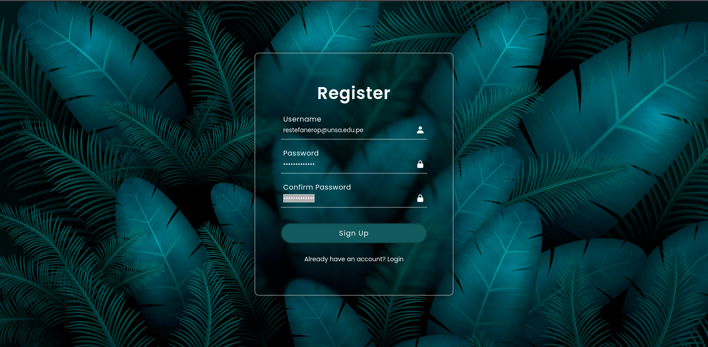
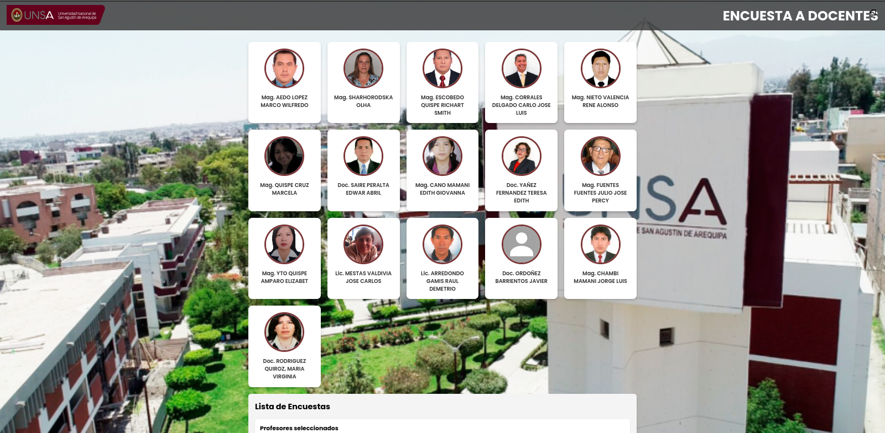
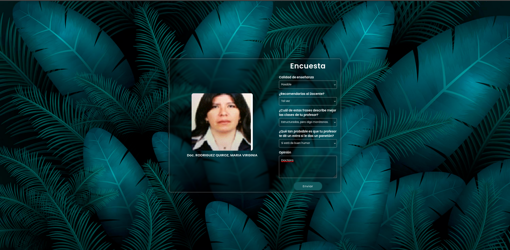

<div align="center">
<table>
    <theader>
        <tr>
            <td></td>
            <th>
                <span style="font-weight:bold;">UNIVERSIDAD NACIONAL DE SAN AGUSTIN</span><br />
                <span style="font-weight:bold;">FACULTAD DE INGENIERÍA DE PRODUCCIÓN Y SERVICIOS</span><br />
                <span style="font-weight:bold;">DEPARTAMENTO ACADÉMICO DE INGENIERÍA DE SISTEMAS E INFORMÁTICA</span><br />
                <span style="font-weight:bold;">ESCUELA PROFESIONAL DE INGENIERÍA DE SISTEMAS</span>
            </th>
            <td></td>
        </tr>
    </theader>
    <tbody>
        <tr><td colspan="3"><span style="font-weight:bold;">Formato</span>: Guía de Práctica de Laboratorio</td></tr>
        <tr><td><span style="font-weight:bold;">Aprobación</span>:  2022/03/01</td><td><span style="font-weight:bold;">Código</span>: GUIA-PRLD-001</td><td><span style="font-weight:bold;">Página</span>: 1</td></tr>
    </tbody>
</table>
</div>

<div align="center">
<span style="font-weight:bold;">GUÍA DE LABORATORIO</span><br />
</div>


<table>
<theader>
<tr><th colspan="6">INFORMACIÓN BÁSICA</th></tr>
</theader>
<tbody>
<tr><td>ASIGNATURA:</td><td colspan="5">Programación Web 1</td></tr>
<tr><td>TÍTULO DEL PROYECTO:</td><td colspan="5">ENCUEST
</td></tr>
<tr>
<td>PROYECTO:</td><td>01</td><td>AÑO LECTIVO:</td><td>2024 b</td><td>NRO. SEMESTRE:</td><td>II</td>
</tr>
<tr>
<td>FECHA INICIO:</td><td>12-Nov-2024</td><td>FECHA FIN:</td><td>16-Dic-2024</td><td>DURACIÓN:</td><td>04 horas</td>
</tr>
<tr><td colspan="6">RECURSOS:
    <ul>
        <li><a href="https://git-scm.com/book/es/v2">https://git-scm.com/book/es/v2</a></li>
        <li><a href="https://guides.github.com/">https://guides.github.com/</a></li>        
        <li><a href="https://www.perl.org/get.html">https://www.perl.org/get.html</a></li>
    </ul>
</td>
</<tr>
<tr><td colspan="6">DOCENTES:
<ul>
<li>Richart Smith Escobedo Quispe - rescobedoq@unsa.edu.pe</li>
 </ul>
      </td>
    </tr>
    <tr>
      <td colspan="6">
        <strong>INTEGRANTES DEL GRUPO:</strong>
        <ul>
          <li>Estefanero Palma Rodrigo - restefanerop@unsa.edu.pe</li>
          <li>Quispe Mamani Jose Gabriel - josquispem@unsa.edu.pe</li>
        </ul>
      </td>
    </tr>
  </tbody>
</table>

# Git - GitHub - Perl


[![Git][Git]][git-site]
[![GitHub][GitHub]][github-site]
[![Perl][Perl]][perl-site]

#

## OBJETIVOS TEMAS Y COMPETENCIAS

### OBJETIVOS

- Poner en practica lo aprendido tanto las clases de laboratorio como las de teoria.
- Tener la capacidad de dominar los temas avanzados para realizar el proyecto.

### TEMAS Y HERRAMIENTAS
- Docker
- Git
- GitHub
- Perl
- JavaScript
- AYAX
- CRUD
- Base de Datos

### EXPLICACION DEL PROYECTO
- El proyecto trata de un apartado de encuesta que va dirigido hacia los estudiantes, el cual falicitara la encuesta que se realiza cada que se finaliiza el semestre,
  esta pagina tendra los siguientes apartados:
  ### 1. INGRESO CON EL CORREO INSTITUCIONAL
  - Esto se podra hacer de manera que garantize el anonimato del que realizara la encuesta, esto por el temor a que se pueda detectar al encuestador por el solo ingreso de su correo.
  
  ### 2. APARTADO DE LOS DOCENTE
  - Aqui se mostraran los Docentes de la Escuela, se podra vizualizar al docente y para la realizacion de la encuesta, solo se debera hacer click a la fotografia del docente.
  
  ### 3. ENCUESTA
  - En este aparatado se mostrara la encuesta que constara de 5 preguntas que se podran calificar con una escala del 1 al 5, tambien como ultimo apartado se podra dar una opinion del docente encuestado.
  
  ### 4. ESCALA GENERAL DE CALIFICACION
  - Al culminar la encuesta, se mostrara una pequeña calificación genral de todos los docentes, desde el menor calificado hasta el mayor calificado.
  
## 5. EJECUCION DE LA PAGINA
       
- Contruccion de la imagen 
    -   ```sh
        docker build -t proyecto_apache .
        ```

- Creacion del contenedor en el puerto 8094
    -   ```sh
        docker run -d -p 8094:8094 --name contenedor_apache proyecto_apache
        ```

- link de la Pagina
    -   ```sh
        http://localhost:8094
        ```
## OBEJTIVO DEL PROYECTO
### 1. BIRNDAR FACILIDAD
  - Este proyecto tiene como objetivo ayudar a la Escuela y tambien a la casa Agustin.
    
### 2. TRANSPARENCIA
  - Esto se refiere a que se podra garantizar si el docente con mayor espectativas se vea reflejado en la escala general de todos los docentes.
    
### 3. FLEXIBILIDAD 
  - Este proyecto tambien podra ayudar a los administradores, a que solo se cambie cierto apartado donde se podran ver la lista de docentes y el cual se podra modificar conforme pasen los semestres y existan cambio de la plana de docentes, esto con el objetivo de que el administrador no tenga dificultades al momento de actualizar la pagina.


## REPOSITORIO EN DONDE SE TRABAJO

- Este trabajo fue grupal por que se acordo trabajar en un solo repositorio y los demas trabajando como colaboradores.
    - GitHub en donde se trabajo
    -   ```sh
        https://github.com/RoEsPa/pw1-24b/tree/main/Proyecto_Final
        ```

    - Aqui se podra ver la lista de commits que se realizaron en el repositorio.
       - Comits del Alumno Rodrigo Estefanero Palma
    -   ```sh
          https://github.com/RoEsPa/pw1-24b/commits/main/Proyecto_Final?author=RoEsPa
        ``` 
        - Rama donde se realizo los comits del Alumno Jose Gabriel Quispe Mamani
    -   ```sh
          https://github.com/RoEsPa/pw1-24b/activity?ref=Jose-Gabriel-Quispe-Mamani
        ```
## EXPLICACIONES


## VIDEOS QUE SIRVIERON DE AYUDA PARA EL PROYECTO
### 1.Uso de crud
- [Uso de CRUD con JavaScript - YouTube](https://www.youtube.com/watch?v=KiRKUTDYlG8) - Video tutorial que explica cómo implementar operaciones CRUD utilizando JavaScript.
  

- [Implementación de CRUD en Perl - YouTube](https://www.youtube.com/watch?v=s_Q8fG1wfbI) - Video tutorial que enseña cómo realizar operaciones CRUD (Crear, Leer, Actualizar y Eliminar) utilizando el lenguaje Perl en aplicaciones web.
    


### 2.login/logut
- [Implementación de Login/Logout - YouTube](https://www.youtube.com/watch?v=9TuQGIVw4XY) - Implementación un sistema de login y logout en una aplicación web.
  

- [Implementación de Login/Logout con JavaScript - YouTube](https://www.youtube.com/watch?v=wcCVjUpNveg) - Desarrollar un sistema de login y logout utilizando JavaScript.
  

### 3.Reporte
- [Generación de Reportes - YouTube](https://www.youtube.com/watch?v=N0gaK2GJ0So) - Video tutorial que explica cómo generar reportes dinámicos en aplicaciones web.
  


## RUBRICA DE CALIFICACIÓN

- En esta rubrica el alumno debe autocalificarse de manera consciente.
  
<div align="center">
    <table border="1" cellspacing="0" cellpadding="5">
        <thead>
            <tr>
                <th>ITEM</th>
                <th>DESCRIPCIÓN</th>
                <th>EXCELENTE</th>
                <th>PROCESO</th>
                <th>DEFICIENTE</th>
            </tr>
        </thead>
        <tbody>
            <tr>
                <td><strong>Código fuente</strong></td>
                <td>Hay porciones de código fuente importantes con numeración y explicaciones detalladas de sus funciones.</td>
                <td align="center">4</td>
                <td align="center"></td>
                <td align="center"></td>
            </tr>
            <tr>
                <td><strong>Ejecución</strong></td>
                <td>Se incluyen ejecuciones/pruebas del código fuente explicadas gradualmente hasta llegar al código final del requerimiento del laboratorio.</td>
                <td align="center">4</td>
                <td align="center"></td>
                <td align="center"></td>
            </tr>
            <tr>
                <td><strong>Pregunta</strong></td>
                <td>Se responde con completitud a la pregunta formulada en la tarea. (El profesor puede preguntar para refrendar calificación). Si no se le entregó pregunta, usted recopile información relevante para el laboratorio desde diferentes medios, referenciada correctamente (máximo 2 caras).</td>
                <td align="center"></td>
                <td align="center">2</td>
                <td align="center"></td>
            </tr>
            <tr>
                <td><strong>Ortografía</strong></td>
                <td>El documento no muestra errores ortográficos.</td>
                <td align="center">4</td>
                <td align="center"></td>
                <td align="center"></td>
            </tr>
            <tr>
                <td><strong>Madurez</strong></td>
                <td>El Informe muestra de manera general una evolución de la madurez del código fuente, explicaciones puntuales pero precisas y un acabado impecable. (El profesor puede preguntar para refrendar calificación).</td>
                <td align="center"></td>
                <td align="center">2</td>
                <td align="center"></td>
            </tr>
            <tr>
                <td colspan="2" align="center"><strong>CALIFICACIÓN</strong></td>
                <td align="center"><strong>12</strong></td>
                <td align="center"><strong>4</strong></td>
                <td align="center"><strong></strong></td>
            </tr>
        </tbody>
    </table>
</div>

- NOTA TOTAL: 16


## REFERENCIAS

- [Documentación de Perl](https://perldoc.perl.org/) - Guía completa de la sintaxis, funciones y módulos de Perl.
- [Expresiones regulares en Perl](https://perldoc.perl.org/perlre) - Detalles sobre el uso de expresiones regulares en Perl.
- [Introducción a CGI en Perl](https://www.tutorialspoint.com/perl/perl_cgi.htm) - Tutorial sobre cómo crear scripts CGI en Perl para desarrollo web.
- [Uso de Docker para entornos Perl](https://docs.docker.com/samples/perl/) - Documentación oficial de Docker para la configuración de entornos Perl.
- [Creación de archivos Dockerfile](https://docs.docker.com/engine/reference/builder/) - Documentación para configurar y escribir un Dockerfile.
- [Uso del elemento `<div>` en HTML](https://developer.mozilla.org/es/docs/Web/HTML/Element/div) - Guía sobre el uso del elemento `<div>` para estructurar el contenido en HTML.
- [Estilos modernos con CSS](https://developer.mozilla.org/es/docs/Web/CSS) - Documentación para crear estilos CSS modernos.
- [Configuración de un servidor web Apache en Docker](https://hub.docker.com/_/httpd) - Información para ejecutar un servidor web Apache en Docker.
- [¿Qué es AJAX? - AWS](https://aws.amazon.com/es/what-is/ajax/) - Información sobre AJAX, sus beneficios, funcionamiento y cómo permite la comunicación asíncrona entre cliente y servidor sin recargar páginas web.
- [¿Qué es CRUD? - HubSpot](https://blog.hubspot.es/website/que-es-crud) - Explicación de qué es CRUD, su significado en el desarrollo web, y cómo las operaciones Crear, Leer, Actualizar y Eliminar son fundamentales para manejar bases de datos.
- [¿Qué es una base de datos SQL? - TIC Portal](https://www.ticportal.es/glosario-tic/base-datos-sql) - Introducción a las bases de datos SQL, cómo funcionan, sus características principales y su importancia en la gestión de datos estructurados.
- [Cómo obtener variables de sesión en JavaScript - Bito.ai](https://bito.ai/resources/javascript-get-session-variable-javascript-explained/) - Guía sobre cómo acceder a las variables de sesión en JavaScript, explicando su uso y cómo se pueden gestionar en el navegador.


#

[Git]: https://img.shields.io/badge/git-%23F05033.svg?style=for-the-badge&logo=git&logoColor=white
[git-site]: https://git-scm.com/

[GitHub]: https://img.shields.io/badge/github-%23121011.svg?style=for-the-badge&logo=github&logoColor=white
[github-site]: https://github.com/

[Perl]: https://img.shields.io/badge/Perl-%23345B91.svg?style=for-the-badge&logo=perl&logoColor=white
[perl-site]: https://www.perl.org/get.html


[![Git][Git]][git-site]
[![GitHub][GitHub]][github-site]
[![Perl][Perl]][perl-site]


